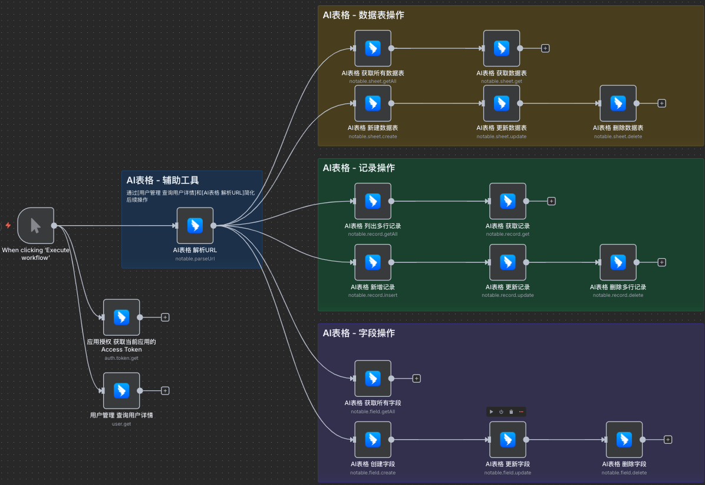

# 钉钉 n8n 节点 (DingTalk n8n Node)

[](https://badge.fury.io/js/@cryozerolabs%2Fn8n-nodes-dingtalk)
[](LICENSE)

这是一个钉钉（DingTalk）的 n8n 社区节点，让你可以在 n8n 工作流中集成钉钉开放平台的各种 API。

钉钉是阿里巴巴集团打造的企业级智能移动办公平台，为全球企业组织提供一站式的数字化办公解决方案。本节点基于钉钉开放平台 API 开发，支持 AI 表格、用户管理、身份验证等核心功能。

> ⚡ 使用教程、最佳实践等详尽说明请访问项目 Wiki：<https://github.com/cryozerolabs/n8n-nodes-dingtalk/wiki>

## 📖 目录
- [支持的功能](#-支持的功能)
- [安装指南](#-安装指南)
- [身份验证配置](#-身份验证配置)
- [使用方法](#-使用方法)
- [示例工作流](#-示例工作流)
- [兼容性](#-兼容性)
- [相关资源](#-相关资源)
- [版本历史](#-版本历史)
- [贡献指南](#-贡献指南)

## ✨ 支持的功能

### 🤖 身份验证 (Auth)
- **获取访问令牌** - 自动获取和刷新 access_token

### 📊 AI 表格 (Notable)

- **解析 URL** - 从钉钉 AI 表格 URL 提取 baseId、sheetId、viewId
- **数据表管理**：
  - 新建数据表
  - 获取数据表信息
  - 获取所有数据表
  - 更新数据表
  - 删除数据表
- **字段管理**：
  - 创建字段
  - 获取所有字段
  - 更新字段
  - 删除字段
- **记录操作**：
  - 新增记录
  - 获取单条记录
  - 获取记录列表
  - 更新记录
  - 删除记录


### 📄 文档 (Doc)
- **获取资源上传信息** - 查询文档指定资源的上传地址

### 👥 用户管理 (User)
- **获取用户详情** - 根据 userId 获取用户信息(unionId)


## 🚀 安装指南

### 通过 n8n 社区节点安装（推荐）

1. 打开你的 n8n 实例
2. 进入 **设置** → **社区节点**
3. 选择 **安装社区节点**
4. 输入包名：`@cryozerolabs/n8n-nodes-dingtalk`
5. 点击 **安装**

更多安装详情请参考 [n8n 社区节点安装指南](https://docs.n8n.io/integrations/community-nodes/installation/)。

## 🔐 身份验证配置

本节点使用钉钉开放平台的企业内部应用认证方式。你需要准备以下信息：

### 1. 创建钉钉企业内部应用

1. 登录 [钉钉开放平台开发者后台](https://open-dev.dingtalk.com/)
2. 创建企业内部应用
3. 在基础信息 - 凭证与基础信息 - 应用凭证 中，获取应用的 `Client ID` 和 `Client Secret`

### 2. 配置 n8n 凭据

在 n8n 中创建 **钉钉 API** 凭据：
- **Corp ID**: 你的钉钉应用运行的组织ID，在[钉钉开放平台开发者后台](https://open-dev.dingtalk.com/)获取
- **Client ID**: 你的钉钉应用 ClientId
- **Client Secret**: 你的钉钉应用 ClientSecret
- **操作人 unionId（可选）**: 如果已经拿到常用操作人的 unionId，可在此填写，节点会默认复用，可以通过 用户管理 查询用户详情 节点获取后回写到凭证中；也可留空，后续在节点中按需覆盖；

### 3. 权限配置

确保你的钉钉应用具有相应的权限，在 应用详情 - 开发配置 - 权限管理 中进行配置。
具体权限请详细阅读官方相关API文档或者运行时的报错信息。

详细的身份验证流程请参考：[钉钉 API 调用指南](https://open.dingtalk.com/document/development/how-to-call-apis) 和 [获取访问令牌](https://open.dingtalk.com/document/development/api-gettoken)。

## 📝 使用方法

### 基本步骤

1. **配置凭据**：按照上述步骤配置钉钉 API 凭据
2. **添加节点**：在工作流中添加 "DingTalk Node"
3. **选择资源**：选择要使用的功能模块（AI表格、用户管理等）
4. **选择操作**：选择具体的操作类型
5. **配置参数**：填写必要的参数（如表格ID、用户ID等）

> 提示：Notable 记录类操作提供 “发送请求体” 模式选择。默认的“表单”模式适合逐项填写；如需直接粘贴官方示例，可切换到“JSON”模式。

### 获取必要参数

#### AI 表格参数
- **baseId**: 通过 "解析URL" 操作从钉钉表格分享链接中提取
- **sheetId**: 同样可以通过 "解析URL" 操作获取
- **operatorId**: 默认复用凭证中的 `userUnionId`。如需指定其他操作人，可在节点中勾选 **不使用凭证中的操作人** 后手动填写或使用表达式引用

#### 用户参数
- **userId**: 钉钉用户的唯一标识符

### 扩展功能 - 调用其他钉钉 API

本节点目前已实现钉钉开放平台的核心功能。对于尚未开发的 API 接口，你可以通过以下方式扩展使用：

#### 1. 获取统一访问令牌

使用本节点的 **身份验证** → **获取访问令牌** 操作来获取 `access_token`：

```json
{
  "resource": "auth",
  "operation": "auth.tokenGet"
}
```

#### 2. 使用 HTTP Request 节点

将获取的 `access_token` 用于 n8n 的 **HTTP Request** 节点来调用任何钉钉 API：

**基本配置示例：**
- **方法**: POST/GET（根据 API 要求）
- **URL**: `https://api.dingtalk.com/v1.0/[API路径]`
- **Headers**: 
  ```json
  {
    "x-acs-dingtalk-access-token": "{{ $json.accessToken }} }}",
    "Content-Type": "application/json"
  }
  ```
- **Body**: 根据具体 API 要求配置

**实际应用示例：**
1. 先运行 "获取访问令牌" 节点
2. 在 HTTP Request 节点中引用上一步的 token
3. 调用你需要的钉钉 API

这种方式让你可以使用钉钉开放平台的任何 API，而不受本节点当前功能的限制。所有的身份验证和令牌管理都由本节点自动处理。

## 🎯 示例工作流

我们提供了完整的示例工作流供你参考和使用：

### 下载示例

所有示例工作流都存放在 `examples/` 目录中，你可以：

**直接下载单个文件**：访问 [examples 目录](https://github.com/cryozerolabs/n8n-nodes-dingtalk/tree/main/examples) 下载需要的 JSON 文件


### 示例内容

- **基础-AI表格操作** (`基础-AI表格操作.json`) - 完整演示：
  - 用户信息获取（获取 unionId）
  - AI 表格 URL 解析
  - 数据表完整 CRUD 操作
  - 记录完整 CRUD 操作
  - 访问令牌获取
- **更多示例正在开发中** - 用户管理、身份验证、扩展功能等

### 导入工作流

1. 在 n8n 中点击 **Import from URL** 或 **Import from File**
2. 选择对应的示例 JSON 文件
3. 配置你的钉钉 API 凭据
4. 运行测试

### 已知问题

- 暂无已知的版本兼容性问题
- 如遇到问题，请提交 [GitHub Issue](https://github.com/cryozerolabs/n8n-nodes-dingtalk/issues)

## 📚 相关资源

### 官方文档
- [钉钉开放平台](https://open.dingtalk.com/)
- [钉钉 API 调用指南](https://open.dingtalk.com/document/development/how-to-call-apis)
- [钉钉访问令牌获取](https://open.dingtalk.com/document/development/api-gettoken)
- [AI 表格 API 文档](https://open.dingtalk.com/document/orgapp/overview-ai-form)

### n8n 相关
- [n8n 官方文档](https://docs.n8n.io/)
- [n8n 社区节点文档](https://docs.n8n.io/integrations/community-nodes/)
- [n8n 入门指南](https://docs.n8n.io/try-it-out/)

### 社区支持
- [GitHub 仓库](https://github.com/cryozerolabs/n8n-nodes-dingtalk)
- [问题反馈](https://github.com/cryozerolabs/n8n-nodes-dingtalk/issues)
- [功能请求](https://github.com/cryozerolabs/n8n-nodes-dingtalk/discussions)

## 📋 版本历史

### v0.3.4
- 增强http请求，钉钉应用申请权限后，需要使用新的access_token才会生效，对于`应用尚未开通所需的权限：[XXX.XXX.XXX]`错误，尝试刷新access_token（即使用户没有去修改权限） 

### v0.3.3
- 修复了AccessToken过期后无法自动刷新的问题

### v0.3.0
#### ⚠️ 升级提示 

v0.3.0 重构了 AI 表格记录操作的参数模型，请在升级后逐一检查旧工作流中的相关节点：

1. 打开所有 **记录新增/获取/更新/删除/列表** 节点，确认 `发送请求体` 设为你期望的模式（推荐使用默认的“表单”模式，或切换成“JSON”并粘贴原始请求体）。
2. 在表单模式下，根据需要重新录入筛选条件、列映射等字段；新的界面支持空/非空判断、AND/OR 组合和多值输入。
3. 如果你过去依赖手写的 `operatorId`，现在默认会读取凭证里的 `userUnionId`。勾选 **不使用凭证中的操作人** 后即可手动填写或使用表达式覆盖。

完成以上步骤后，保存并重新运行工作流以验证行为是否符合预期。

#### 凭证
- 新增 `操作人ID（unionId）` 字段，可在凭证中预填常用操作人的 unionId，避免每个节点重复输入

#### AI 表格
- 统一封装 `baseId`、`sheetId`、`operatorId` 参数，所有记录类操作使用相同的引用方式
  - `baseId`：支持 `By ID`、`From URL` 两种模式，自动解析分享链接
  - `sheetId`：支持 `By ID`、`From URL`、`From List`（可搜索数据表列表）
  - `operatorId`：默认读取凭证中的 `userUnionId`，可勾选“**不使用凭证中的操作人**”后覆盖
- 记录类操作的请求体改为“表单 / JSON”双模式，默认表单模式，便于逐字段编辑
- “列出多行记录”提供增强型筛选器：表单/JSON 双模式、AND/OR 组合、多值输入、空/非空判断
- “新增记录”“更新记录”结合 Resource Mapper，支持自动映射输入数据或手动定义字段
- “删除多行记录”允许使用逗号分隔的 ID 列表，批量输入更轻松

#### 文档
- 新增 “获取资源上传信息” 操作，可直接为钉钉文档生成上传地址


### v0.1.1
- ✅ 字段管理功能增强：新增字段创建、更新、删除、获取所有字段等操作

### v0.1.0
- ✅ 实现钉钉身份验证
- ✅ 自动刷新access_token
- ✅ AI表格数据表、记录的操作
- ✅ 获取用户详情(拿unionId)
- ✅ 额外支持对AI表格URL解析获取baseId、sheetId、viewId
- ✅ Resource + Operation 自动聚合

## 🤝 贡献指南

我们欢迎社区贡献！如果你想为这个项目贡献代码：

1. Fork 本仓库
2. 创建你的特性分支 (`git checkout -b feature/AmazingFeature`)
3. 提交你的更改 (`git commit -m 'Add some AmazingFeature'`)
4. 推送到分支 (`git push origin feature/AmazingFeature`)
5. 打开一个 Pull Request

### 开发环境设置

```bash
# 1. 克隆仓库
git clone https://github.com/cryozerolabs/n8n-nodes-dingtalk.git
cd n8n-nodes-dingtalk

# 2. 安装依赖
npm install

# 3. 安装 n8n-node 开发工具（如果尚未安装）
npm install -g n8n-node

# 4. 构建项目
n8n-node build

# 5. 设置开发环境变量（可选，用于调试）
export NODE_ENV=development
export N8N_LOG_LEVEL=debug

# 6. 启动 n8n 开发服务器（自动加载当前节点）
n8n-node dev

# 7. 代码格式化和检查
npm run format
npm run lint
```

**开发提示：**
- **`n8n-node dev`** 会自动启动一个包含当前节点的 n8n 测试环境
- **测试环境**默认运行在 `http://localhost:5678`
- 详细的开发文档请参考 [n8n 社区节点开发指南](https://docs.n8n.io/integrations/creating-nodes/)

## 📄 许可证

本项目采用 MIT 许可证 - 查看 [LICENSE](LICENSE) 文件了解详情。

## 🏷️ 关键词

钉钉, DingTalk, n8n, workflow, automation, 工作流, 自动化, AI表格, 企业应用, API, 集成, 阿里巴巴

---

**开发者**: [CryoZero Labs](https://github.com/cryozerolabs)  
**维护状态**: ✅ 积极维护  

如果这个节点对你有帮助，请给我们一个 ⭐ Star！
